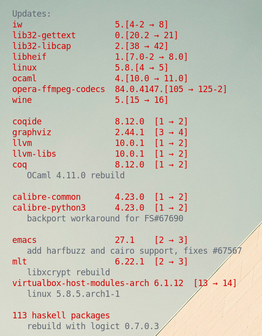

# update-fmt

This is a script that lists outdated packages on your Arch system.

The output is formatted for use with Conky, but with minimal modifications you should be able to get it to work with terminal or other display methods.

## Differences from `checkupdates`:

- Separates pkgrel bumps (rebuilds) from actual upstream updates.
- Displays commit messages for pkgrel bumps.
- Hides haskell package rebuilds, since these can get pretty spammy.
- Fancy formatting:
  - Common version prefixes joined together.
  - "-1" and ".arch1" pkgrel suffix removed.

## Dependencies

- `pyalpm`
- `python-lxml`

Both can be installed from official repositories.

## Example conky config fragment

```
$hr
${color1}Updates:
${execpi 3600 ~/.local/bin/update-fmt}$color
$hr
```

### Screenshot

